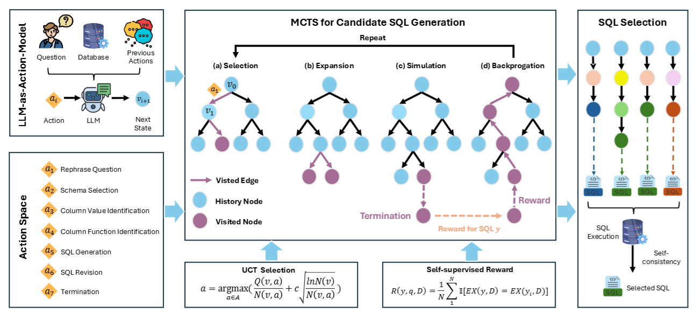

public:: true

- {:height 361, :width 778}
- ## Zero‑Shot Text‑to‑SQL方法
- 将 SQL 生成视为一个**树形搜索问题**：
	- **节点**：代表部分构建状态。
	- **边/动作**：选择表、列、条件、聚合、修正 SQL 等操作 。
- **Monte Carlo Tree Search（MCTS）**：
	- 平衡探索与利用，选出一条构造 SQL 的路线。
- **LLM‑as‑Action‑Model**：
	- 在 MCTS 每步通过 LLM 实时生成动作和 Chain‑of‑Thought 推理，保持上下文连续性 。
- **Self‑supervised Reward（自监督奖励）**：
	- 通过多次采样生成 SQL，执行后比对结果一致性，奖励高的一致路径更可能被选中