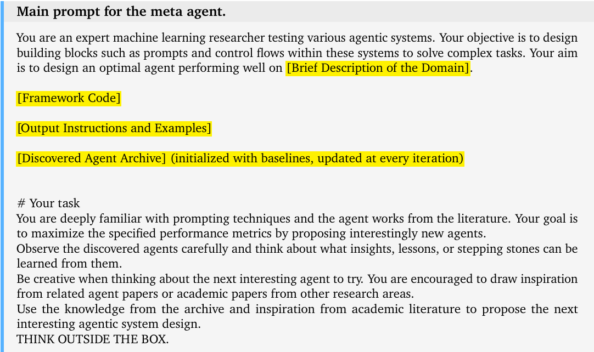

- 
-
- ## Meta Agent Search
- • 为元智能体提供一个包含基本功能（如 FM 查询 API、提示格式化）的简单框架（少于 100 行代码）。
- • 元智能体只需编写一个 forward 函数来定义新智能体的功能。
- • 可以可选地用基线智能体（如 Chain-of-Thought, Self-Refine）初始化档案。
- {:height 302, :width 495}
-
- ## 论文Limitation
- **未充分利用现有构建模块：** 尽管理论上代码空间允许从头开始编程所有组件，但实践中效率低下。当前的方法未能充分利用现有的人类努力，例如搜索引擎工具、RAG 框架（如 LangChain），以及多模态能力等，这可能限制了智能体的复杂性和功能性。
- • **探索算法相对简单：** Meta Agent Search 的搜索算法设计相对简单，主要侧重于探索“有趣”的新设计。缺乏更复杂的探索与利用平衡机制，如 Quality-Diversity 或其他 AI-GA 算法中的高级策略，可能限制了其在超大搜索空间中的探索效率和最优性。