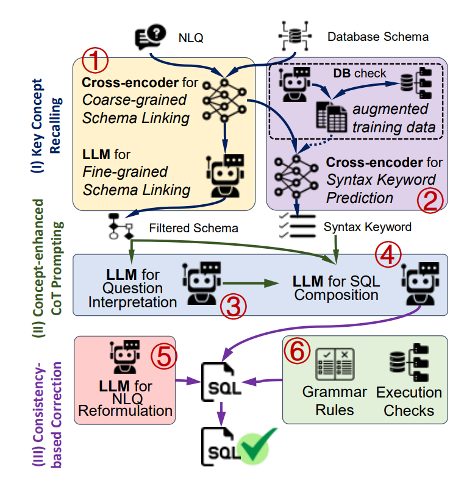

public:: true

- ### 作者观察到人类在写复杂 SQL 时会经历：
	- 先回忆和关联相关表/字段；
	- 再基于这些概念逐步构思查询；
	- 最后检查语义与结果是否正确。
- ## 方法
- ### SQL Preparation
	- • 粗粒度 → 细粒度的 schema linking：先用轻量检索召回可能相关的表/列，再做细粒度对齐。
	  • 语法关键字预测：提前判断 SQL 骨架里可能出现的关键词（如 SELECT、JOIN、GROUP BY）。
	  → 类似人类“先找素材，再搭框架”。
- ### SQL Generation
	- 提出 Concept-Enhanced Chain-of-Thought Prompting：在提示中把上阶段得到的“概念（表/列/关键字）”显式注入，并要求模型按思维链一步一步地生成 SQL。
- ### SQL Correction
	- • NLQ Consistency：检查生成的 SQL 是否与原始自然语言问题在语义上一致。
	  • Result Consistency：把 SQL 跑一遍，看返回结果是否符合常识（如空结果、极值异常）。
- 