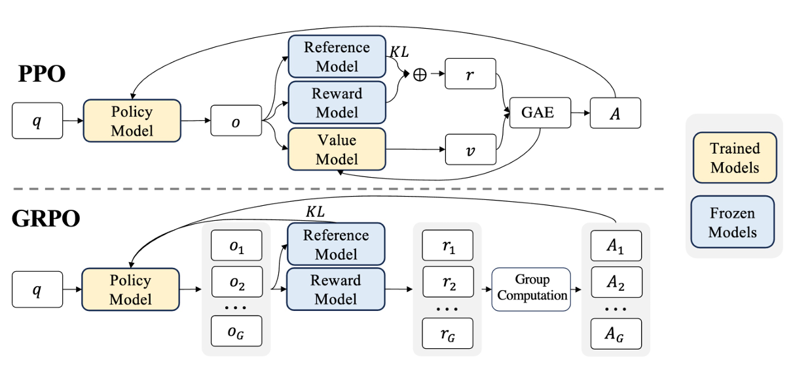

public:: true

- 
- 不再使用独立的价值模型，而是通过组奖励来估计基线
- GRPO从旧策略中抽取多个输出（形成组），利用组内奖励信息计算优势值，以此优化策略
- 没有Critic网络，减少了显存需求，也省去了在高维、庞大的状态空间下学习一个准确估计Value的模型的难度
- 与[[PPO]]的区别在于优势计算步骤
- #+BEGIN_EXPORT latex
  \hat{A}_{i,t} = \frac{r_i - \text{mean}(\{R_i\}_{i=1}^G)}{\text{std}(\{R_i\}_{i=1}^G)}.
  #+END_EXPORT
-