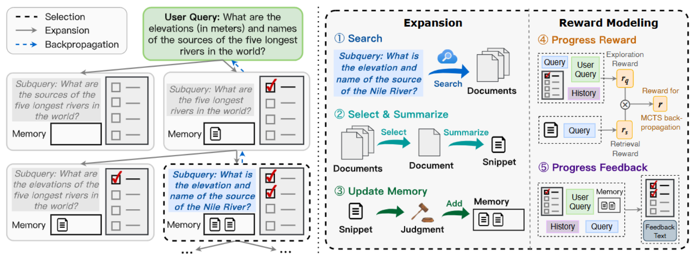

public:: true

- ## SIGIR 2025
- {:height 305, :width 778}
-
- ## 背景
- **单轮检索**（如 BM25、Dense Retrieval）只能处理局部相关性，无法保证**全局覆盖**
- **多轮检索**（如 ReAct、IRCoT）虽然能迭代，但缺乏：
	- **结构化目标**（不知道下一步该查什么）；
	- **全局视角**（容易重复、漏查、跑偏）；
	- **进度感知**（不知道“还差多少信息才完整”）。
- ## 方法
- 把检索过程建模为**“渐进式知识收集”**
- 用**自适应清单**显式列出所有需要覆盖的子维度；
- 用**MCTS**在庞大的搜索空间中**有目的、有进度地探索**；
- 用**知识记忆**避免重复和冲突。
-
- ### 策略模型
	- 将复杂查询分成一系列子目标(提供明确的全局引导信号，避免无关探索)
- ### MCTS迭代
	- #### Selection
		- 使用UCT（Upper Confidence Bound applied to Trees）公式选择价值最高的节点
	- #### Expansion
		- 策略模型通过两步扩展多个新节点：
		- 首先，根据
			- **历史上下文**：包括原始复杂查询(例如“Destiny’s Child的录音室专辑发行日期”)、最近的进度反馈 (描述哪些子目标已完成或未完成)、之前的子查询​
			- **自适应清单**：列出查询分解后的子目标（例如“列出所有专辑”“查找发行日期”）
			- **知识记忆**：存储之前收集的信息片段（如专辑名称或部分发行日期）
			- 策略模型生成新的子查询，子查询针对清单中的某个未解决子目标
		- 随后子查询被输入搜索引擎，返回一组相关文档，策略模型选出最相关文档
		- 提取的片段经过奖励模型评估，若相关则加入知识记忆
	- ### Evaluation
		- 策略模型与奖励模型(?这个没看到具体是什么) 协作，生成多视角奖励
		- #### 多视角奖励
			- 探索奖励：评估子查询与清单中未完成子目标的一致性
			- 检索奖励：评估提取的信息片段与子查询的相关性
			- 进度反馈：文本形式的反馈，哪些子目标已完成、哪些仍未解决
	- ### Backpropagation
		- 把奖励从新节点传播到根节点​，更新节点访问次数和价值
- ### 答案生成
	- MCTS终止后（当所有子目标完成或达到最大树深度）
	- 使用策略模型基于知识记忆(包含所有信息片段)token-by-token生成最终答案