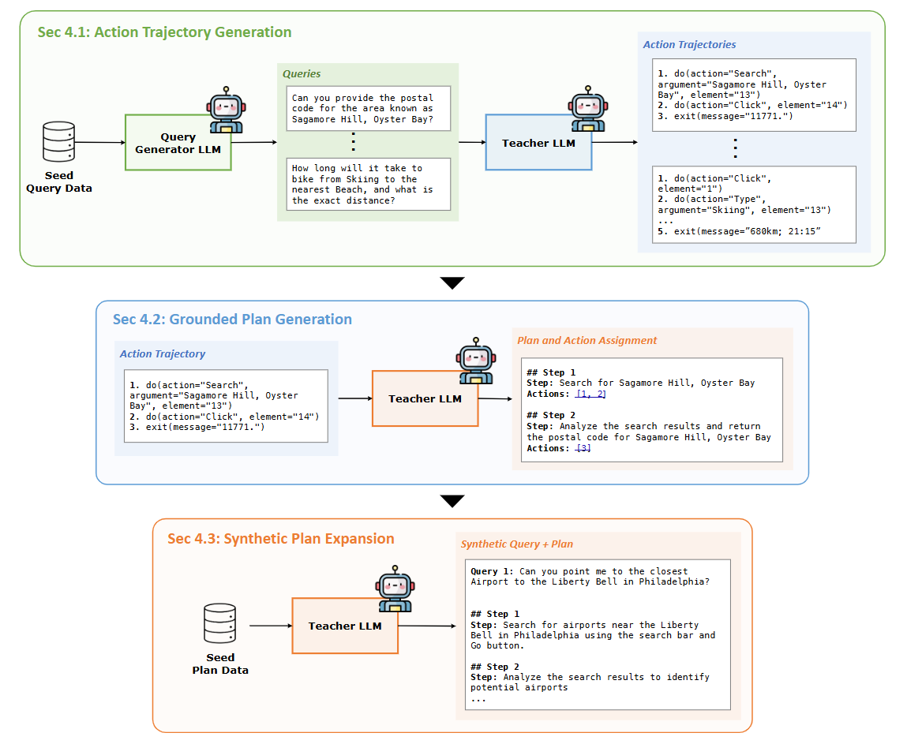

public:: true

- ## ICML 2025
-
- ## 方法
- 提出“高层规划”和“底层执行”明确解耦的框架
- ### Planner
- 训练用合成数据生成——如何让 LLM 抽象出**逻辑正确、粒度合适、且无幻觉**的高阶步骤
- 
-
- 生成方法
	- 取成功的动作轨迹，把连续动作切成“子目标已达成”的片段：
		- 用规则检测**里程碑事件**，例如：
			- URL 发生 domain/路径级变化
			- 页面上出现关键词（“checkout”, “results”, “success”）
			- DOM 出现新按钮/表单（用 XPath diff）
		- 每到一个里程碑，就把前面的动作序列截成一段
		- 丢弃过短（k<3）或过长（k>15）的 chunk，减少噪声
	- 让 LLM 写“计划步骤”标注(注意限制动词表（search, click, filter, fill, submit, scroll…）防止自由发挥)
	- 把同一任务的所有 chunk 的高层动作按时间顺序拼成计划，删除冗余/错误步骤
		- **去循环**：若相邻两步 high_action 相同，合并。
		- **因果检查**：让 LLM 再次扮演“验证者”
		  prompt：
		  `计划是否能在给定起始页面执行？若不能，指出哪一步缺少前置条件。`
		  若验证失败，整条轨迹丢弃。此步筛掉 ~12% 噪声。
		- **多样性增强**：同一条轨迹用不同 prompt 模板再生成 3 个“同义不同词”版本，提升鲁棒性。
		- 对计划做随机替换对象名词、随机替换动词、随机增减冗余步骤的泛化改写生成
	- 做聚类，删除余弦相似度 >0.95 的重复项
	- 用 Executor 做一次 dry-run，此步再筛 8% 左右。
- ## Executor
- 执行动作的LLM
-
- ## 重规划
- **每步**完成 EXECUTOR 步骤后，PLANNER 就重新更新计划，而非只依赖初始方案。每次迭代，PLANNER 接收当前状态、先前计划与已执行动作，并生成新的剩余计划，指导 EXECUTOR 继续完成用户指令。
-