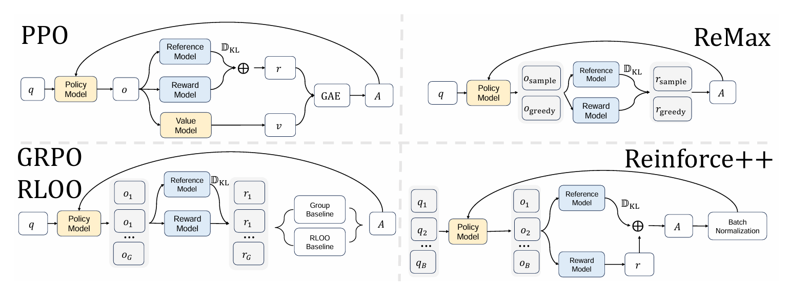

public:: true

- 思想就是 REINFORCE算法+PPO trick
- **REINFORCE**  算法概念上更简单，不需要价值网络，但它存在**梯度估计方差高**的问题，导致训练效率低下和收敛缓慢。
- 一些基于 REINFORCE 的改进方法，如 **[[RLOO]]**、**[[ReMax]]** 和 **[[GRPO]]**，虽然也移除了价值网络，但在**准确的优势估计**方面面临挑战。它们通常**为每个提示独立估计优势**，这可能导致模型**对简单提示过拟合**，容易**reward hacking**，并且可能引入**偏差**。
- {:height 298, :width 778}
- ## REINFORCE++
- **对每个prompt仅采样一条response计算优势，并在global batch范围内对 token-level的优势做归一化**
- 优势函数：
- #+BEGIN_EXPORT latex
  A_{q,o_t} = r(o_{1:T}, q) - \beta \cdot \sum_{i=t}^T \mathrm{KL}(i)\\
  
  \mathrm{KL}(t) = \log \left( \frac{\pi_{\theta_{\mathrm{old}}}^{\mathrm{RL}}(o_t \mid q, o_{<t})}{\pi^{\mathrm{SFT}}(o_t \mid q, o_{<t})} \right)\\ 
  
  A_{q,o_t}^{\mathrm{norm}} = \frac{A_{q,o_t} - \mathrm{mean} \left( A_{q,o_t} \mid A_{q,o_t} \in \mathcal{D}_{\mathrm{batch}} \right)}{\mathrm{std} \left( A_{q,o_t} \mid A_{q,o_t} \in \mathcal{D}_{\mathrm{batch}} \right)}
  #+END_EXPORT
- ## REINFORCE++-baseline
- 每个prompt生成多个response，优势取平均
- #+BEGIN_EXPORT latex
  A_{q,o_t} = R_{q,o_t} - \text{mean}_{group}(R_{q,o_t}) \\
  A_{q,o_t}^{\text{norm}} = \frac{A_{q,o_t} - \text{mean}_{\text{batch}}(A_{q,o_t})}{\text{std}_{\text{batch}}(A_{q,o_t})}
  #+END_EXPORT
-
- 感觉这种global batch参与计算应该不太适合多任务学习