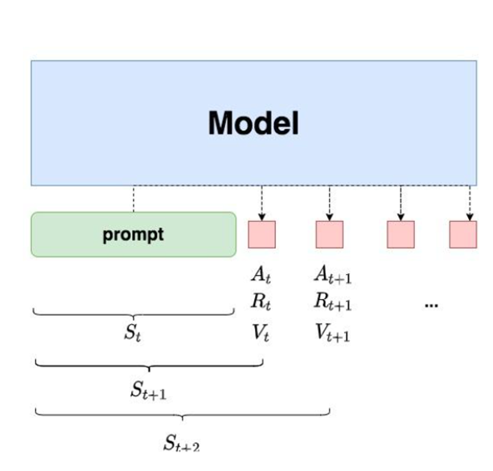

public:: true

- # [[强化学习基本概念]]
- 参考：
	- [《rlhfbook》](https://rlhfbook.com/)
	- [Large Language Models Post-training: Surveying Techniques from Alignment to Reasoning](https://arxiv.org/html/2503.06072v2#S3)
	-
- # Why RL in NLP?
- 很多 NLP 任务本质是每一步做一个离散决策（选词、选句、选操作），最终拼成一个完整的输出。RL 的「序贯决策」框架天然就可以把「搜索过程」显式地建模成马尔可夫决策过程（MDP）。
- 
- 传统监督学习只能优化「可微的代理损失」（交叉熵、MSE），而真正的评测指标（BLEU、ROUGE、Acc、F1）往往是「不可微」的。RL 的「奖励」可以**直接等于最终指标**，从而“端到端”地优化我们真正关心的目标。
- # RL在NLP的缺陷
- ## 奖励稀疏
- 强化学习的成功依赖于清晰且频繁的奖励信号，NLP的翻译、摘要、对话、代码生成等都依赖**整体质量**（BLEU、ROUGE、单元测试通过率）。只有当整句/整段生成完毕才能计算这些指标，中间每一步都没有可量化的局部奖励，对于代码生成，程序通过全部测试=+1，否则 0。没有“部分正确”的中间奖励。
- 词汇表大小 V，序列长度 L，组合爆炸 V^L；随机探索几乎不可能恰好生成高分句子。
- 没有有效的奖励信号将会导致智能体长期“盲搜”，几乎学不到任何有效梯度。
- ## 探索与利用难以平衡
- 在强化学习中，复杂性和多样性意味着每个模型需要不断地进行大量试错才能够收敛；并且模型会不断探索新的策略，而这些策略往往不总是生成有意义或合适的文本（如乱码、无意义的对话等）。
- 而如果语言模型先验太强，策略很快坍缩成“复读机”或“万能回复”，生成多样性骤降，指标看似高实则过拟合(Reward hacking现象)
- # RL in LLM
- 到目前为止，预训练良好的LLM可以在RL训练时提供可靠探索，模型有了可靠探索能力后通过设计的奖励指标就可以比较有效地向着设计的**偏好**fine tune学习
- ## 在后训练的应用
- {:height 66, :width 778}
- ### 微调(Fine Tuning)
- 微调是将预训练大语言模型（LLM）适配到特定任务的核心环节，它通过有针对性的参数调整来精炼模型能力。该过程利用带有标签或任务专属的数据集来优化性能，解决domain gap
	- #### 监督微调(Supervised Fine-Tuning)
	- SFT 直接使用标记数据调整模型参数，从而生成既精确又适应上下文的模型，同时保留泛化能力
	- #### Adaptive Fine-Tuning
	- 该方法引入额外的提示来指导模型生成输出，为定制模型响应提供了灵活的框架。包括**instruction tuning** 和 **prompt-based tuning**
	- #### 强化微调(ReFT) ——OpenAI称之为RFT(注：RFT也可以是拒绝采样微调）
	- **(上面链接中的综述论文中的分类，说白了就是SFT+RL，放在这个FT分类里比较牵强)**
	- 与传统 SFT 仅为每道题提供单一思维链（CoT）标注不同，ReFT 允许模型探索多条有效推理路径，从而增强其泛化能力与解题技巧
- ### 对齐(Alignment)
- 对齐目的是引导模型输出符合人类期望与偏好，尤其在涉及安全或面向用户的关键场景中
- **核心： 奖励模型 ≈ 人类偏好的可计算近似**
	- #### 基于人类反馈的强化学习(RLHF)
	- 纯粹SFT中带注释数据的多样性和质量可能参差不齐，且监督模型难以捕捉更细微或更具适应性的人类偏好。为此提出了基于强化学习 (RL) 的微调用于对齐来解决这些缺点
	- **人类反馈**是 RLHF 的核心，它为奖励模型提供用户偏好信息并指导策略更新
	- 常见的人类反馈分类有：
		- **评价**：人类对智能体行为的显式评分，通常经二元或多标签标注精炼以降低噪声
		- **比较**：人类对多条输出或轨迹进行排序；候选集越大，信号越丰富，但也可能带来因果混淆
		- **跨时反馈**： 在不同时间步提供判断，以细化对整条轨迹的评估
		- **代理奖励**： 引入近似奖励函数，引导模型朝向用户设定的目标
		- **社交行为** ：利用隐含线索（如面部表情）使智能体目标与用户情绪保持一致
		- **改进** ： 实时、具体的人类干预，来渐进式地优化策略
		- **自然语言反馈**：顾名思义
		- **紧急停止(e-stops)**：直接中止智能体的当前轨迹，目的是阻止不良行为
		- **重要性标签**：指出特定观测对达成目标的重要性
		- **特征轨迹**：用于表征学习，人类指出某些可观测的特征的单调变化(比如车速越低，轨迹行为单调变好)
		- **相似度查询**：通过比较三条轨迹的相似性，借助轨迹空间中的成对距离来指导表征学习
		- 表征学好了奖励模型不容易学偏
	- **奖励模型**：
		- 大部分RLHF需要一个可学习的奖励模型，用于预测候选输出与人类期望的契合程度，为了训练模型需要人类对输出对进行比较或标注其相对优劣
	- 为了降低人工成本，常用**RLAIF**对齐
	- 
	- #### [[DPO(Direct Preference Optimization)]]
		- RLHF 复杂的难点在于创建一个能够准确反映人类偏好的奖励模型，以及在优化估计奖励的同时，保持与原始模型接近的微调。DPO直接优化策略，不建模奖励模型
- ### 推理(Reasoning)
	- 推理过程也可以被建模为一个**序列决策过程**
	- 从强化学习的视角看推理：
		- 针对输入查询 x，迭代地构建一系列中间步$a_1, a_2, ..., a_T$，以最大化获得正确最终答案的可能性。
		- 状态$s_t$表示时间步 t 时的推理轨迹
		- 状态会随着推理过程而动态演化，它既融合了由模型生成的显式推理路径，也融合了从上下文中提取的潜在知识。例如在数学证明中，状态可能包括题设、已推导的等式，以及可适用定理的记忆，从而帮助模型在多个步骤中保持逻辑一致性。
		- 动作 $a_t$表示选择下一步推理的方式，它可以是：生成推理过程的词或短语，应用预定义的逻辑或数学变换（如代数简化），从知识库中选择相关定理或规则，或在获得结论时终止推理
		- 奖励函数为推理提供关键反馈，指导模型的学习过程(个人认为是最重要的部分)
			- ORM(Outcome Reward Model)是在生成模型中，对生成结果整体打分评估，或者直接环境反馈
				- Deepseek-R1-Zero用的是ORM
			- PRM(Process Reward Mode)是在生成过程中，分步骤对每一步进行打分的更细粒度奖励模型。
				- Deepseek-R1用的PRM
- 
- ## RL-LLM算法
- ### [[PPO]]  ☆☆
- ### [[GRPO]]
- ### [[DrGRPO]]
- ### [[DAPO]] ☆
- ### [[ReMax]]
- ### [[RLOO]]
- ### [[REINFORCE++]]
- ### [[PRIME]]
- ### [[The Entropy Mechanism of Reinforcement Learning for Reasoning Language Models]] ☆
- ### [[LUFFY]] ☆☆
- ## RL与SFT
- ### [[SRFT]]
- ### [[Reinforcement Learning Finetunes Small Subnetworks in Large Language Models]]
- ## RL in Text2SQL
-