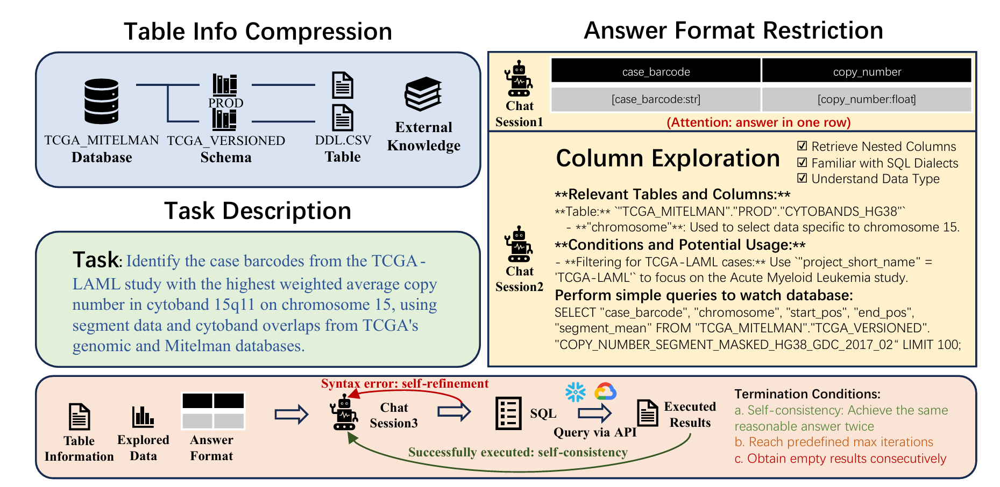

public:: true

- ## 问题
	- 数据库模式（schema）庞大复杂（超过 3000 列）
	- SQL 方言多样（如 BigQuery、Snowflake）
	- 查询需求复杂（如涉及数据转换、分析等）
	- Spider2.0数据集，面向code-agent任务，给定：问题 ，数据库接口 ，代码库，目标是基于观察结果，迭代的修改代码； 存在多种 SQL 方言、嵌套列、复杂数据类型等挑战
- ## 方法
- 
	- 将整体流程**拆解为可控子任务**
	- ### Table Information Compression
		- **基于模式的匹配压缩方法**：将具有相似前缀或后缀的表合并，只保留一个代表性 DDL 文件；对其他表则仅提供表名。
		- 例如，在 GA360 数据库中，有整整一年的表，命名从 `GA_SESSIONS_20160801` 到 `GA_SESSIONS_20170801`，每个表的 DDL 文件超过 150KB，总大小超过 50MB
	- ### Expected Answer Format Restriction(感觉比较吃工程经验)
		- 在开始阶段就生成答案格式，在整个自我优化过程中不断强化格式要求。响应必须**严格遵循 CSV 风格格式**，每一列都需明确标注名称和属性（包括百分比、极值、坐标等），对于不清晰的术语，可增加可能值或额外列来维持精度
	- ### Exploration of Potentially Useful Columns
		- **缺乏值类型与 SQL 方言的细节**常常导致反复修正语法、数据类型或函数调用错误，既耗时又难以进行有效推理，同时对于嵌套列，即使少量样例行也可能太长；样例中的值分布也可能失真，误导模型。
		- 通过一个独立的LLM生成多个简单SQL(禁止使用 CTE、跨 schema 查询)语句识别潜在有用的列：
			- 使用提示词定位相关表与列
			- 从简单非嵌套查询逐步过渡到复杂嵌套查询
			- 加深模型对数据库结构、数据类型的理解
	- ### Self-Refinement Workflow for Problem-Solving
		- 在获得表信息 `P_init`、探索性数据（即列提示 `P_column` 与执行结果 `R_exploration`）以及期望答案格式 `F` 之后，将这些元素输入模型，进行**自我优化流程**
		- 模型**纠正错误**、**改进答案**，并通过self-consistency最终生成高置信度的结果
		- 如果上述自我优化流程**未能成功生成有效 SQL**，我们还会进一步尝试使用**CTE（通用表表达式，Common Table Expressions）**构建逐步的数据流程，将复杂查询拆解为多个更易处理的子查询
		-
-