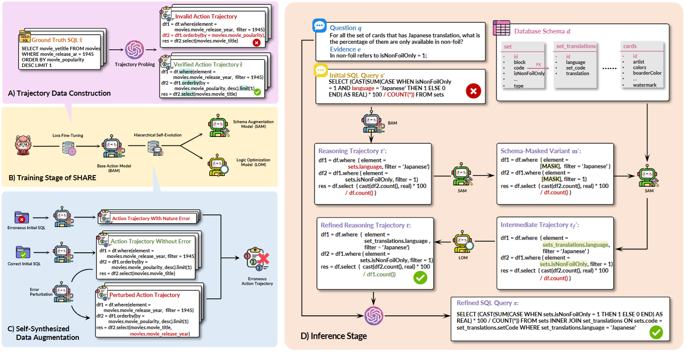

public:: true

- ## 背景
- ### 当前挑战
- 现有方法在处理复杂SQL查询时，难以有效检测和纠正错误，尤其是在低资源训练环境下。
- LLM在自校正过程中存在自我增强偏差，导致其难以准确识别自身生成的SQL查询中的错误。
- 目前传统的自校正方法依赖LLM的递归调用，计算开销大。
- 基于执行反馈的自调试方法在主流SQL方言中反馈信息不足，难以准确定位错误。
- ## 贡献
- 提出了SHARE，一种基于小型语言模型（SLM）的分层动作校正助手，旨在提升大型语言模型（LLM）在文本到SQL转换中的错误定位和校正能力。
- 包括基础动作模型（BAM）、模式增强模型（SAM）和逻辑优化模型（LOM）
- ### BAM
- BAM将原始SQL查询转换为动作轨迹。比如，当我们说"找一本关于二战的历史书，作者是英国人，出版于2000年后"时，BAM会将其分解为：1）找历史类书籍；2）筛选主题为二战的书；3）筛选英国作者的书；4）筛选2000年后出版的书。
- ### SAM
- SAM检查并修正这些步骤中与数据库结构相关的错误。比如，检查"历史类"是否是图书馆的一个有效分类，"作者国籍"是否是可查询的属性等。
- ### LOM
- LOM优化这些步骤的逻辑关系，确保这些步骤的逻辑关系正确，能够组合成一个有效的查询。比如，确保先按主题筛选，再按作者筛选，最后按出版日期筛选，而不是搞混顺序。
- 