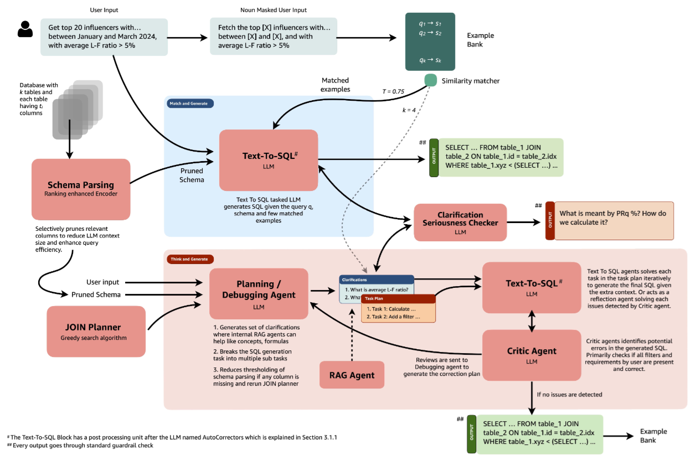

public:: true

- | 组件                                  | 解决痛点                                    | 关键技术点                                                                                                            |
  | ----------------------------------- | --------------------------------------- | ---------------------------------------------------------------------------------------------------------------- |
  | **Table Onboarder**（表接入器）       | • 企业表结构千奇百怪，缺索引、缺 FK、缺注释 → 生成 SQL 容易错/慢 | • 自动分析表结构、采样数据   • 推荐索引、分区、FK 补全• 把“表体检报告”注入 prompt，显著降低幻觉                                                  |
  | **SQL Generator**（两级生成器）        | • 单 LLM 推理深 → 延迟高• 多 LLM 协同 → 成本高   | • **Hybrid Router**: 简单查询用 1-shot 小模型（<200 ms）• **Multi-Agent Deep Reasoner**: 复杂查询用 3-Agent 链式推理（准确率↑，延迟可控） |
  | **Feedback Augmentation**（反馈增强） | • 线上案例无法回流训练• 错误查询无法自动修复            | • Dry-run 沙箱执行 → 筛出正确 SQL 对，入“黄金示例库”• 错误案例自动改写后再次生成 → 形成“在线微调”闭环                                             |
- 