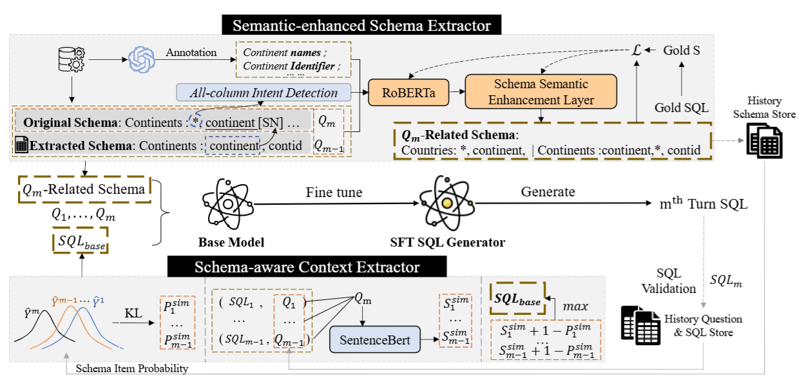

public:: true

- ## 背景
- **多轮对话**中，面临两大挑战：
	- **动态 schema 链接**：用户每轮提问可能涉及不同的数据库表或字段。
	- **上下文信息复杂**：用户可能引用或省略前面轮次的信息，系统需要准确理解上下文。
- 传统方法（如 EditSQL、STaR、CoE-SQL）要么依赖历史 SQL，要么缺乏对源上下文的验证，导致错误累积。
- ## 方法
- ### Semantic-enhanced Schema Extractor (SESE)
	- #### Schema Semantic Enhancement Layer
		- 引入注意力门控机制，增强数据库模式的语义表示，解决命名歧义问题(比如说：在“Continents”表中，“continent”列可能表示“大陆名称”；而在“Countries”表中，“continent”列可能表示“大陆ID”）
		- 有了增强表示后对每个候选 schema，模型都会输出一个“它跟当前用户问题相关”的概率值。
		- 设定一个阈值 s(阈值需要调参)，只保留概率 ≥ s 的对象
		- 让最相关的排schema在前面，减少后面模型的噪声
		- 把排序后的 schema 列表 + 外键关系（foreign key）一起序列化成一段文本
	- #### All-Column Intent Detection
		- 因为用户的问题可能不明确指定需要的列，比如：**每个洲有哪些国家？**
		- 同理把`*`当成一个**特殊的虚拟列**，给每一张表都计算一个需要`*`的概率。
		- 如果某张表的概率超过阈值，就把`*`当作该表的列之一送入后续 SQL 生成器。
- ### Schema-aware Context Extractor (SACE)
	- 1.考虑当前问题与历史问题的语义相关性
	- 2.结合历史模式存储提供的模式项概率，衡量两个问题涉及的实体重叠情况
	- 最后选出得分最高的那条历史信息
-
- 最后论文表示多轮问题被精简为单轮对话了，拿去单轮对话SFT了一下(不是很懂有什么意义，可能就是为了缩短上下文，让训练更简单一些吧)
- 