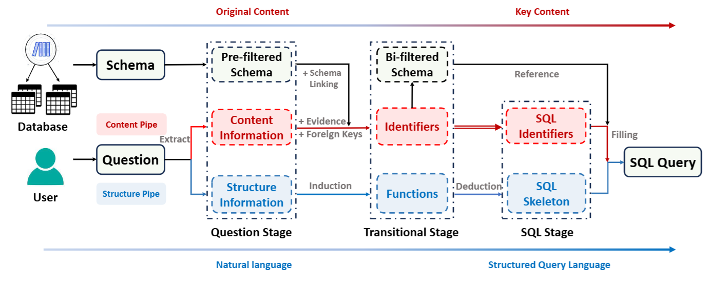

- 
- ## 背景
- 以往方法常常关注数据库结构，忽略实际值，这会导致
- **歧义问题**：自然语言问题中的词汇可能无法直接对应到数据库结构。
- **语义缺失**：无法理解“值”的上下文含义，导致生成的 SQL 不准确。
- ## 方法
- ### 问题提取
	- **数据库预过滤**之后
	- **结构通道（Structure Pipe）**：提取暗示 SQL 操作符或结构的短语。
	- **内容通道（Content Pipe）**：“实体、值、列、表”等关键词。
- ### 自然语言->标识符和操作符
	- **证据融合**：用外部知识（evidence）把口语化表述对齐到列名，如 “average salary” → 列 `A11`。
	- **外键扩展**：自动把相关外键列加入候选集，确保能把多张表连起来。
	- 在预过滤后的 schema 里，用模糊匹配 + 列描述找到最匹配的表/列，形成精简后的 **bi-filtered schema**；同时得到最终标识符集合 `I`。
	- **函数推导**：根据结构信息推导出 SQL 函数/关键字，如 `the youngest` → `ORDER BY … DESC LIMIT 1`。
	- 得到最终的函数集合 `F`。
- ### 组装
- ‑ 依据 structure pipe 给出的函数集合 `F` 与问题上下文，让 LLM 先生成带占位符的骨架：
- `SELECT [column] FROM [table] … ORDER BY [col] ASC LIMIT 1`
- 用 content pipe 得到的标识符集合 `I` 和 bi-filtered schema，把占位符换成真正的表名、列名、条件值。
-