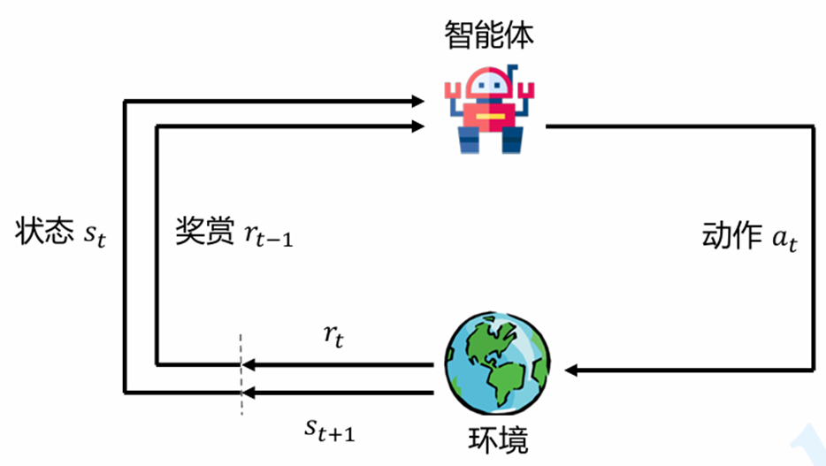

public:: true

- 参考：
	- [动手学强化学习](https://hrl.boyuai.com/)
	- [Reward Design  for Reinforcement Learning Agents](https://arxiv.org/abs/2503.21949)
	- [Reinforcement Learning:Theory and Algorithms](https://rltheorybook.github.io/rltheorybook_AJKS.pdf)
	-
- # 强化学习概念
- 强化学习是机器通过与**环境交互**来实现目标的一种计算方法。机器和环境的一轮交互是指，机器在环境的一个**状态**下做一个**动作**决策，把这个**动作**作用到**环境**当中，这个**环境**发生相应的改变并且将相应的**奖励反馈**和**下一轮状态**传回机器。这种交互是迭代进行的，机器的目标是最大化在多轮交互过程中获得的累积奖励的**期望**。
- 强化学习用**智能体（agent）**这个概念来表示做决策的机器。相比于有监督学习中的“模型”，强化学习中的“智能体”强调机器不但可以感知周围的环境信息，还可以通过做决策来直接改变这个环境，而不只是给出一些预测信号。
- ## 适用场景
- 强化学习（RL）最适合**没有固定答案、需要长期决策、环境反馈延迟或动态变化**的问题。
- 当**模型（转移概率、奖励函数）**已知且状态空间可枚举时可用动态规划；当模型未知或状态空间大到无法完全枚举时用强化学习。
- 场景通常需要满足：**序列决策**、**环境动态变化**、**试错成本低**、**无法即时获得反馈**
- ## 强化学习基本要素
- ### 马尔可夫过程
- #### 马尔可夫性
- 当且仅当某时刻的状态只取决于上一时刻的状态时，一个随机过程被称为具有**马尔可夫性**，当前状态是未来的充分统计量，即下一个状态只取决于当前状态，而不会受到过去状态的影响。
- 马尔可夫性并不代表这个随机过程就和历史完全没有关系，而是$t$时刻的状态其实包含了$t-1$时刻的状态的信息，历史信息被传递为现在的状态。马尔可夫性可以大大**简化运算**，因为只要当前状态可知，所有的历史信息都不再需要了，利用当前状态信息就可以决定未来。
- 注意也有不完全符合马尔可夫性的强化学习建模：如部分可观测(POMDP)的建模方式只能获取到部分的观测信息而非完整状态破坏了马尔可夫性
- #### 马尔可夫过程
- **马尔可夫过程**指具有马尔可夫性质的随机过程，也被称为**马尔可夫链**。我们通常用元组$<S,P>$描述一个马尔可夫过程，其中$S$是有限数量的状态集合，$P$是**状态转移矩阵**。假设一共有个状态，此时。状态转移矩阵定义了所有状态对之间的转移概率，即
- #+BEGIN_EXPORT latex
  \mathcal{P}=
  \begin{bmatrix}
  P(s_1|s_1) & \cdots & P(s_n|s_1) \\
  \vdots & \ddots & \vdots \\
  P(s_1|s_n) & \cdots & P(s_n|s_n)
  \end{bmatrix}
  #+END_EXPORT
- ### 马尔可夫奖励过程
- $<S,P,r,γ>$
- $r$是奖励函数，某个状态$s$的奖励$r(s)$指转移到该状态时可以获得奖励的期望。
- $γ$是折扣因子。引入折扣因子的理由为远期利益具有一定不确定性，有时我们更希望能够尽快获得一些奖励，所以我们需要对远期利益打一些折扣。接近 1 的更关注长期的累计奖励，接近 0 的更考虑短期奖励。
- 从第$t$时刻状态$S_{t}$开始，直到终止状态时，所有奖励的衰减之和称为**回报**
- #+BEGIN_EXPORT latex
  G_t = R_t + \gamma R_{t+1} + \gamma^2 R_{t+2} + \cdots = \sum_{k=0}^{\infty} \gamma^k R_{t+k}
  #+END_EXPORT
- #### 价值
- 一个状态的期望回报（即从这个状态出发的未来累积奖励的期望）被称为这个状态的**价值（value）**，所有状态的价值就组成了**价值函数**(**贝尔曼方程**)
- #+BEGIN_EXPORT latex
  V(s) = r(s) + \gamma \sum_{s' \in S} p(s'|s)V(s')
  #+END_EXPORT
- 求解较大规模的马尔可夫奖励过程中的价值函数时，通常可以使用**动态规划**（dynamic programming）算法、**蒙特卡洛方法**（Monte-Carlo method）和**时序差分**（temporal difference）
- ### 马尔可夫决策过程
- 在马尔可夫奖励过程（MRP）的基础上加入动作，就得到了马尔可夫决策过程（MDP）。
- $<S,A,P,r,γ>$
- 其中奖励和状态转移与状态和动作共同决定 $r(s,a)$ $P(s'|s,a)$
- 
- 智能体的**目标**是最大化得到的**累计奖励(期望)**。
- #### 策略
- 智能体根据当前状态从动作的集合中选择一个动作的函数，被称为**策略**，通常用$π$表示
- 当一个策略是**确定性策略**（deterministic policy）时，它在每个状态时只输出一个确定性的动作，即只有该动作的概率为 1，其他动作的概率为 0；
- 当一个策略是**随机性策略**（stochastic policy）时，它在每个状态时输出的是关于动作的概率分布，然后根据该分布进行采样就可以得到一个动作。
- #### 价值函数
- 价值函数定义为从状态$s$出发遵循策略$π$能获得的期望回报
- #+BEGIN_EXPORT latex
  V^\pi(s) = \mathbb{E}_\pi \big[ R_t + \gamma V^\pi(S_{t+1}) \mid S_t = s \big]
  = \sum_{a \in A} \pi(a \mid s) \Big( r(s,a) + \gamma \sum_{s' \in S} p(s' \mid s,a)V^\pi(s') \Big)
  #+END_EXPORT
- #### 动作价值函数(一般叫Q函数)
- Q函数表示在 MDP 遵循策略$π$时，对当前状态执行动作$a$得到的期望回报
- #+BEGIN_EXPORT latex
  \begin{aligned}
  Q^\pi(s,a) & =\mathbb{E}_\pi[R_t+\gamma Q^\pi(S_{t+1},A_{t+1})|S_t=s,A_t=a] \\
   & =r(s,a)+\gamma\sum_{s^{\prime}\in S}p(s^{\prime}|s,a)\sum_{a^{\prime}\in A}\pi(a^{\prime}|s^{\prime})Q^\pi(s^{\prime},a^{\prime})
  \end{aligned}
  #+END_EXPORT
- #### 采样
- 采样表示从环境里拿数据，当前智能体根据策略执行动作完成一步(step)动作收集的$<S,A,r>$的过程一般称为**sample**。
- 智能体根据当前策略从初始$S_0$状态开始收集数据$τ=<S_0,A_0,r_0,...S_n,A_n,r_n>$称为一条轨迹(**trajectory**)，这个过程一般称为**rollout**。
- 从初始态到终止态的rollout数据可以被称为**episode**，而**trajectory**没有那么强调终止态，也可以表示一个状态到另一个状态的一段过程数据。目前看来sample/rollout，trajectory/episode 实际使用经常混着来不会分太清楚。
- ## 深度强化学习算法
- 因为智能体的**目标**是最大化得到的**累计奖励(期望)**，所以强化学习算法需要通过迭代优化策略以达到**最优策略**，使其能达到最优奖励
- #+BEGIN_EXPORT latex
  \pi^* = \arg\max_{\pi} V^{\pi}(s), \forall s
  #+END_EXPORT
- ### value-based算法
- value-based算法不直接学习策略，而是学习**value函数**，通常是**Q函数**(因为Q函数直接关联动作，能明确指导策略好坏)，它表示在某个状态 s下采取动作 a后，能获得的预期累积奖励。策略通过价值函数推导，例如选择Q值最大的动作。
- **注意**value-based算法在动作是**连续**分布时较难解决，需要做额外的处理才能支持连续的动作空间(如在 $a$ 空间随机/网格采样若干候选，取最大$Q$、对 $a$求梯度、让$Q$对$a$**二次可导且凹**等方法)
- #+BEGIN_EXPORT latex
  Q(s, a) \leftarrow Q(s, a) + \alpha \left[ r + \gamma \max_{a'} Q(s', a') - Q(s, a) \right]
  #+END_EXPORT
- 优化这个Q函数的思想是：
	- 计算一个“目标值”，这个目标值是由当前的即时奖励加上对下一个状态可能获得的最大未来奖励的折扣估计组成的。
	- 将这个“目标值”与当前的 $Q(s,a)$ 估计值进行比较，得到一个误差（TD误差）
	- 学习率*误差 更新 $Q(s,a)$
- ### policy-based算法
- policy-based算法直接优化策略
- #+BEGIN_EXPORT latex
  \nabla_{\theta} J(\theta) = \mathbb{E}_{\tau \sim \pi_{\theta}} \left[ \sum_{t=0}^{T} \nabla_{\theta} \log \pi_{\theta}(a_t | s_t) \cdot A^{\pi_{\theta}}(s_t, a_t) \right]
  #+END_EXPORT
- 公式中值得注意的是：
	- 对于每一个状态动作对$(s_t​,a_t​)$，计算策略的对数概率梯度再乘上一个**优势函数**(早期算法直接使用回报$G_t$受环境影响，可能会波动很大导致算法无法收敛)来鼓励模型增加那些“好于平均”的动作的概率，而不是简单地增加所有带来正回报的动作的概率
- #### Actor-Critic算法
- 前面的基于值函数的方法只学习一个价值函数，而基于策略的方法只学习一个策略函数。而Actor-Critic算法，既学习价值函数，又学习策略函数。本质上是基于策略的算法额外额外学习价值函数。
- **纯 Policy-based（高方差）和纯 Value-based（难处理连续动作、策略退化）都存在一定缺陷**，Actor-Critic 是一种两者的折中：用 **Critic 降方差 + Actor 灵活输出动作**，从而同时获得**低方差、在线学习、连续动作兼容和稳定收敛**。
- Actor-Critic 算法非常实用，常用的**TRPO、PPO、DDPG、SAC** 等深度强化学习算法都是在 Actor-Critic 框架下进行发展的。
- 包含两个模块：
	- **Actor**：
		- 与环境交互，并在 Critic 价值函数的指导下用策略梯度学习一个更好的策略。
	- **Critic**：
		- 通过 Actor 与环境交互收集的数据学习一个价值函数，这个价值函数会用于判断在当前状态什么动作是好的，什么动作不是好的，进而帮助 Actor 进行策略更新。
- #### 详情算法
- 请查看参考常见RL框架代码文档介绍：
- [DIEngine框架算法document](https://opendilab.github.io/DI-engine/12_policies/index_zh.html)
- [stable-baseline3框架算法document](https://stable-baselines3.readthedocs.io/en/master/modules/base.html)
- ## 强化学习常见概念问题
- ### 强化学习 (Reinforcement Learning) 与监督学习 (Supervised Learning) 的本质区别在于？
- 监督学习是从大量有标签的数据集中进行模式和特征的学习，样本通常是需要满足独立同分布的假设。
- 强化学习不需要带标签的数据集，而是建立在智能体与环境交互的基础上，强化学习会试错探索，它通过探索环境来获取对环境的理解。
	- 用于强化学习训练的样本是有时间关系的序列样本，而且样本的产生与智能体的策略相关。
	- 强化学习中没有强的监督信号，只有稀疏的，延迟的奖励信号。
- ### 什么是 exploration and exploitation？我们通常使用哪些方法平衡 exploration and exploitation？
- exploration 指的是RL中的智能体需要不断的去**探索**环境的不同状态动作空间, 尽可能收集到多样化的样本用于强化学习训练，而 exploitation 指的是智能体需要**利用**好已经获得的“知识”，去选择当前状态下收益高的动作。
- 如果 exploitation 太多，那么模型比较容易陷入局部最优，但是 exploration 太多，模型收敛速度太慢。如何在 exploitation-exploration 中取得平衡，以获得一种累计折扣奖励最高的最优策略，是强化学习中的一个核心问题。
- ### 什么是 model based RL 和 model free RL，两者区别是什么？
- Model based RL 算法指智能体会学习环境的模型 （通常包括状态转移函数和奖励函数），并利用环境模型来进行策略迭代或值迭代，而 model free RL 算法则不需要对环境进行建模。
- 蒙特卡洛和 TD 算法隶属于 model-free RL，因为这两类算法不需要算法建模具体环境。
- 而动态规划属于 model-based RL，因为使用动态规划需要完备的环境模型。
- ### value-based， policy-based，actor-critic，三者分别是什么含义？
- value-based 就是学习值函数（或动作值函数），评价一个状态（状态动作对）的价值，policy-based 是指直接学习一个参数化的策略网络，一般通过策略梯度定理进行优化，而 actor-critic 是同时学习值网络和策略网络，是前面两者的结合，集成了值迭代和策略迭代范式，是解决实际问题时最常考虑的框架。
- ### 什么是 on-policy 和 off-policy，两者区别是什么？
- **on-policy** 是使用**当前的策略**生成的样本进行训练，产生数据样本的策略和用于当前待评估和改进的策略是**相同**的。
- **off-policy** 则是指在更新当前策略时可以用到之前**旧的策略**产生的样本，产生数据样本的策略和当前待评估和改进策略是**不同**的。
- 一般来讲，on-policy 很难平衡探索与利用的问题，容易学习到**局部最优解**，虽然对整体策略的更新**更稳定**但是降低了学习的效率。off-policy 的优势在于重复利用数据进行训练，但是收敛速度与稳定性不如 on-policy 的算法。值得注意的是, Soft Actor Critic 提出的最大熵强化学习算法极大的提高了 off-policy 算法的稳定性和性能。
- ### 什么是 online training 和 offline training？我们通常如何实现 offline training？
- online training 指的是用于 RL 训练的数据是智能体与环境交互实时产生的。 offline training 即是训练时智能体不与环境进行交互，而是直接在给定的固定数据集上进行训练， 比如 behavior cloning 就是经典的 offline training 算法。 通常在固定数据集上采样一个 batch 用于 RL 训练，因此 offline RL 又称为 Batch RL。
- ### 为什么要使用 replay buffer？ experience replay 作用在哪里？
- 智能体与环境交互后产生的数据往往是具有很强的时序相关信息的，由于随机梯度下降通常要求训练的数据符合**独立同分布(i.i.d.)假设**，因此将智能体与环境交互后产生的数据直接用于 RL 训练往往存在稳定性问题。
- 有了 replay buffer 后，我们可以将智能体收集的样本存入 buffer 中，在之后训练时通过某种方式从 buffer 中采样出 mini-batch 的 experience 用于 RL 训练。
- 当 replay buffer 中的数据足够多时，随机抽样得到的数据就能接近 i.i.d.，使得 RL 训练更加稳定。同时由于 experience replay 的存在，智能体收集的样本不是用过就丢弃，结合 off-policy 的算法，能够多次重复利用过去的经验，提高了样本效率。